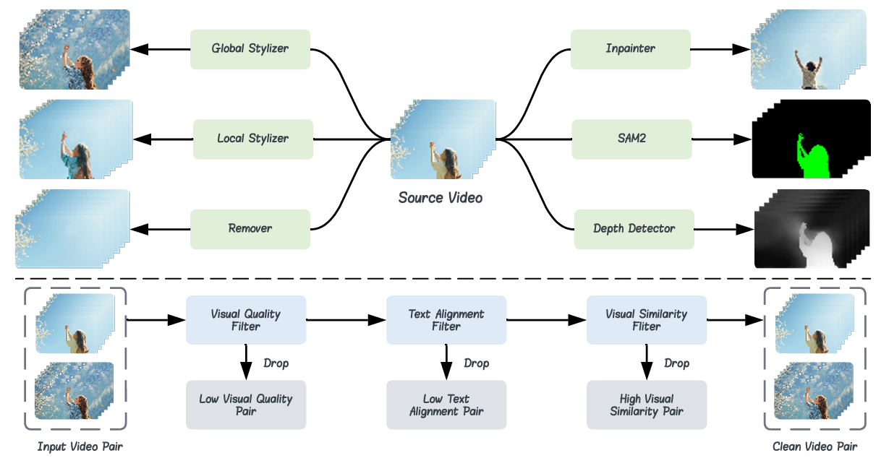
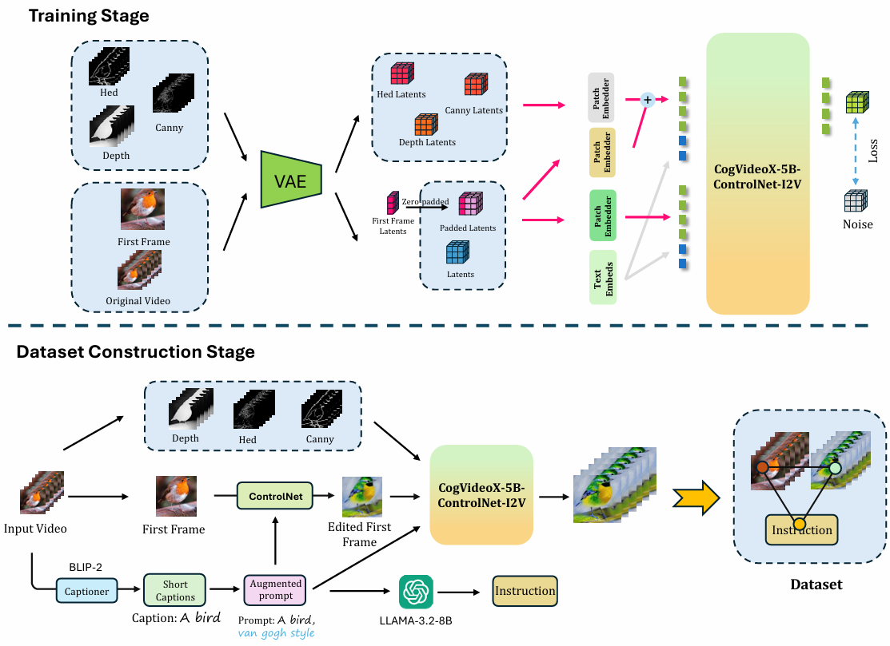
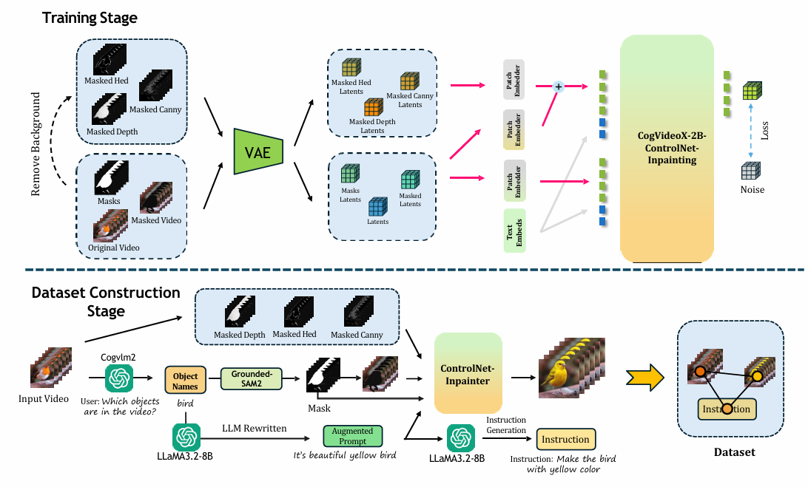
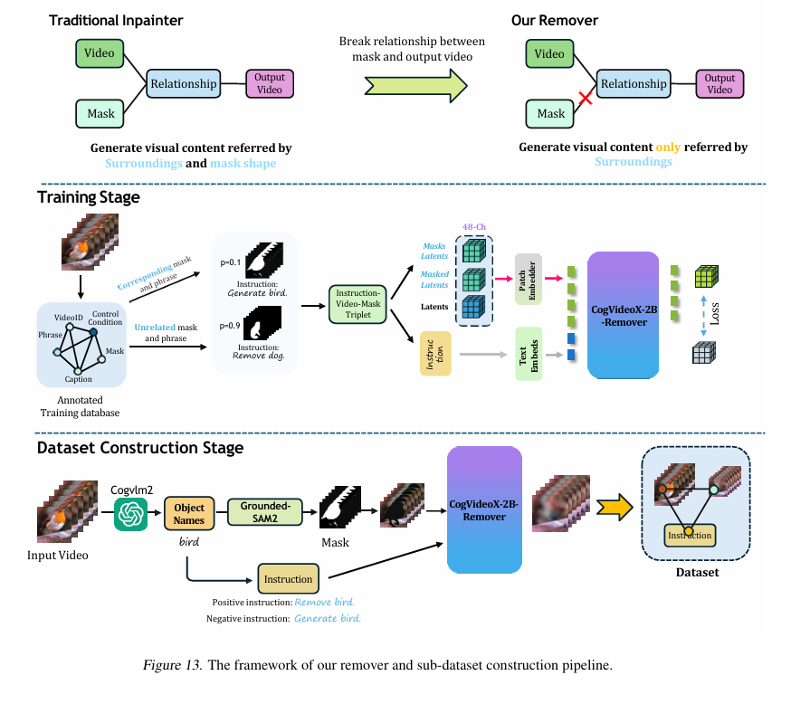

[](https://www.youtube.com/watch?v=L5rZQs-5EjM)

# Señorita-2M: A High-Quality Instruction-based Dataset for General Video Editing by Video Specialists


[](https://huggingface.co/PengWeixuanSZU/Senorita-2M) 
[](https://senorita-2m-dataset.github.io/) 
[](https://huggingface.co/datasets/SENORITADATASET/Senorita)

## 📑 Content

- [📄 Overview](#-overview)
- [📜 Abstract](#-abstract)
- [✨ Key Features](#-key-features)
- [🏗️ Dataset Construction](#-dataset-construction)
- [✂️ Editing Tasks](#-editing-tasks)
- [📚 Paper Content](#-paper-content)
  - [🔄 Dataset Construction Pipeline](#-dataset-construction-pipeline)
  - [🌍 Global Stylization](#-global-stylization)
  - [🎨 Local Stylization](#-local-stylization)
  - [🗑️ Object Removal](#-object-removal)
  - [🔄 Object Swap](#-object-swap)
- [🛠️ How to Use](#-how-to-use)
  - [📦 Install Dependencies](#-install-dependencies)
  - [📥 Download Pretrained Model](#-download-pretrained-model)
- [👥 Authors](#-authors)
- [🔖 Citation](#-citation)
- [📧 Contact](#-contact)

## 📄 Overview

Señorita-2M is a comprehensive and high-quality dataset designed for general video editing tasks. It consists of a vast collection of videos with detailed instructions provided by video specialists.

## 📜 Abstract

Recent advancements in video generation have spurred the development of video editing techniques, which can be divided into inversion-based and end-to-end methods. However, current video editing methods still face challenges in quality and efficiency.

## ✨ Key Features

- **High-Quality Annotations**: Each video in the dataset is accompanied by precise and detailed instructions from professional video editors.
- **Diverse Editing Tasks**: The dataset covers a wide range of video editing tasks, including object removal, object swap, global and local stylization.
- **Large Scale**: With over **2 million** video clips, Señorita-2M is one of the largest video editing datasets available.

## 🏗️ Dataset Construction

We built the dataset by leveraging high-quality video editing experts. Specifically, we trained four high-quality video editing experts using CogVideoX: a global stylizer, a local stylizer, an inpainting expert, and a super-resolution expert.

Furthermore, we trained multiple video editors based on different video editing architectures using this dataset to evaluate the effectiveness of various editing frameworks, ultimately achieving impressive results.

## ✂️ Editing Tasks

Our dataset consists of **18** editing tasks. Five of these tasks are edited by our trained experts, while the remaining tasks are handled by computer vision tasks. The former sub-dataset occupies around 70% of the total dataset size.

## 📚 Paper Content

### 🔄 Dataset Construction Pipeline

The dataset construction pipeline involves several stages, including data collection, annotation, and quality verification. We crawled videos from Pexels, a video-sharing website with high-resolution and high-quality videos, by authenticated APIs. The total number of videos in this part is around 390,000. Each video clip is meticulously annotated by video specialists to ensure the highest quality. The captioning of videos is handled by BLIP-2 to cater to the length restriction of CLIP, while the mask regions and their corresponding phrases are obtained by CogVLM2 and Grounded-SAM2.

### 🌍 Global Stylization

Global stylization involves applying a consistent style across the entire video. This task is performed by the global stylizer trained using CogVideoX, which ensures a uniform look and feel throughout the video. The video ControlNet uses multiple control conditions to get robust style transfer results, including Canny, HED, and Depth, each transformed into latent space via 3D-VAE.

### 🎨 Local Stylization

Local stylization focuses on specific regions within the video, allowing for more detailed and localized effects. Inspired by the inpainting methods, such as AVID, we trained a local stylizer using both inpainting and ControlNet. The model uses three control conditions, same as the global stylizer, inputted into the ControlNet branch. Besides, the mask conditions are fed into the main branch. The pretrained model used is CogVideoX-2B.

### 🗑️ Object Removal

Object removal is a common video editing task where unwanted objects are seamlessly removed from the video. Our inpainting expert is trained to handle this task efficiently, ensuring that the background is accurately reconstructed. Current video inpainters like Propinater generate blur when removing objects, which highly reduces its usability. Thus, we trained a powerful video remover based on CogVideoX-2B, using a novel mask selection strategy.

### 🔄 Object Swap

Object swap involves replacing one object with another within the video. This complex task is managed by our trained video editors, who ensure that the new object blends seamlessly with the surrounding environment. Object swap uses FLUX-Fill and our trained inpainter. To begin with, the LLaMA-3 suggests a replacement object, which is then swapped in the first frame by FLUX-Fill. The inpainter generates the remaining frames guided by the first.

## 🛠️ How to Use

### 📦 Install Dependencies

First, install the required dependencies using the following command:

```sh
pip3 install -r requirements.txt
```

### 📥 Download Pretrained Model

To download the pretrained model, run the following shell scripts:

```sh
huggingface-cli download --resume-download THUDM/CogVideoX-5b-I2V --local-dir ./cogvideox-5b-i2v
```

```sh
huggingface-cli download --resume-download PengWeixuanSZU/Senorita-2M --local-dir ./
```

## 👥 Authors

- <a href="https://zibojia.github.io/" target="_blank">Bojia Zi</a>, The Chinese University of Hong Kong
- <a href="https://scholar.google.com/citations?user=tTUajvgAAAAJ&amp;hl=en" target="_blank">Penghui Ruan</a>, The Hong Kong Polytechnic University
- <a href="https://openreview.net/profile?id=~Marco_Chen1" target="_blank">Marco Chen</a>, Tsinghua University
- <a href="https://scholar.google.com/citations?user=odjSydQAAAAJ&amp;hl=en" target="_blank">Xianbiao Qi</a>, IntelliFusion Inc.
- <a href="https://haoosz.github.io/" target="_blank">Shaozhe Hao</a>, The University of Hong Kong
- <a href="https://shihaozhaozsh.github.io/" target="_blank">Shihao Zhao</a>, The University of Hong Kong
- <a href="https://openreview.net/profile?id=~Youze_Huang1" target="_blank">Youze Huang</a>, University of Electronic Science and Technology of China
- <a href="https://binliang-nlp.github.io/" target="_blank">Bin Liang</a>, The Chinese University of Hong Kong
- <a href="https://scholar.google.com/citations?hl=en&amp;user=Zb5wT08AAAAJ" target="_blank">Rong Xiao</a>, IntelliFusion Inc.
- <a href="https://scholar.google.com/citations?hl=en&amp;user=fyMni2cAAAAJ" target="_blank">Kam-Fai Wong</a>, The Chinese University of Hong Kong

**Note**: * indicates equal contribution. † indicates the corresponding author. **The demo codes were developed by Weixuan Peng.**

## 🔖 Citation

If you use Señorita-2M in your research, please cite our work as follows:

```
@article{zi2025senorita,
  title={Señorita-2M: A High-Quality Instruction-based Dataset for General Video Editing by Video Specialists},
  author={Bojia Zi and Penghui Ruan and Marco Chen and Xianbiao Qi and Shaozhe Hao and Shihao Zhao and Youze Huang and Bin Liang and Rong Xiao and Kam-Fai Wong},
  journal={arXiv preprint arXiv:2502.06734},
  year={2025},
}
```

## 📧 Contact

For more information or any queries regarding the dataset, please contact us at [19210240030@fudan.edu.cn](19210240030@fudan.edu.cn).
