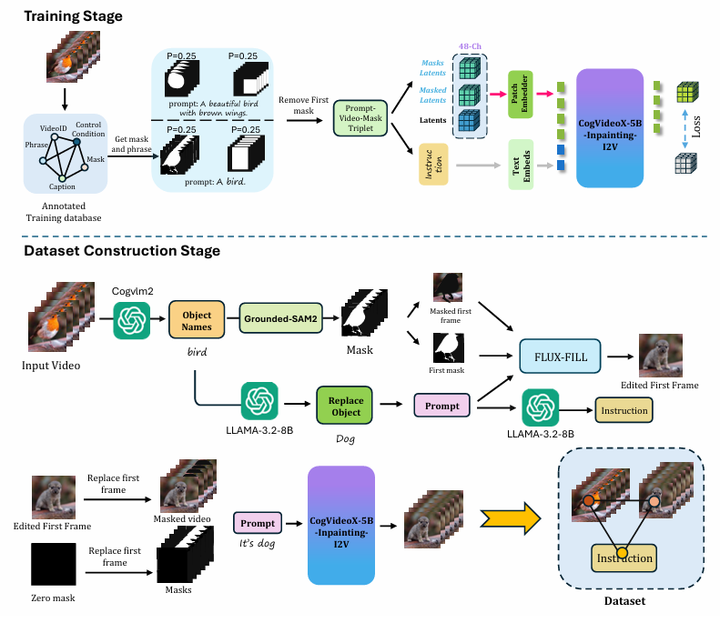

# Señorita-2M: A High-Quality Instruction-based Dataset for General Video Editing by Video Specialists


[](https://huggingface.co/PengWeixuanSZU/Senorita-2M) 
[](https://senorita-2m-dataset.github.io/) 
[](https://huggingface.co/datasets/SENORITADATASET/Senorita)

## Overview

Señorita-2M is a comprehensive and high-quality dataset designed for general video editing tasks. It consists of a vast collection of videos with detailed instructions provided by video specialists.

## Abstract

Recent advancements in video generation have spurred the development of video editing techniques, which can be divided into inversion-based and end-to-end methods. However, current video editing methods still face challenges in quality and efficiency.

## Key Features

- **High-Quality Annotations**: Each video in the dataset is accompanied by precise and detailed instructions from professional video editors.
- **Diverse Editing Tasks**: The dataset covers a wide range of video editing tasks, including object removal, object swap, global and local stylization.
- **Large Scale**: With over 2 million video clips, Señorita-2M is one of the largest video editing datasets available.

## Dataset Construction

We built the dataset by leveraging high-quality video editing experts. Specifically, we trained four high-quality video editing experts using CogVideoX: a global stylizer, a local stylizer, an inpainting expert, and a super-resolution expert.

Furthermore, we trained multiple video editors based on different video editing architectures using this dataset to evaluate the effectiveness of various editing frameworks, ultimately achieving impressive results.

## Editing Tasks

Our dataset consists of 17 editing tasks. Five of these tasks are edited by our trained experts, while the remaining tasks are handled by computer vision tasks. The former sub-dataset occupies around 70% of the total dataset size.

## Sample Images and Videos

### Dataset Construction Pipeline


### Global Stylization


### Local Stylization


### Object Removal


### Object Swap


## Citation

If you use Señorita-2M in your research, please cite our work as follows:

```
@article{zi2025senorita,
  title={Señorita-2M: A High-Quality Instruction-based Dataset for General Video Editing by Video Specialists},
  author={Bojia Zi and Penghui Ruan and Marco Chen and Xianbiao Qi and Shaozhe Hao and Shihao Zhao and Youze Huang and Bin Liang and Rong Xiao and Kam-Fai Wong},
  journal={arXiv preprint arXiv:2502.06734},
  year={2025},
}
```

## Authors

- Bojia Zi, The Chinese University of Hong Kong
- Penghui Ruan, The Hong Kong Polytechnic University
- Marco Chen, Tsinghua University
- Xianbiao Qi, IntelliFusion Inc.
- Shaozhe Hao, The University of Hong Kong
- Shihao Zhao, The University of Hong Kong
- Youze Huang, University of Electronic Science and Technology of China
- Bin Liang, The Chinese University of Hong Kong
- Rong Xiao, IntelliFusion Inc.
- Kam-Fai Wong, The Chinese University of Hong Kong

**Note**: * indicates equal contribution. † indicates the corresponding author.

## Contact

For more information or any queries regarding the dataset, please contact us at [19210240030@fudan.edu.cn](19210240030@fudan.edu.cn).
